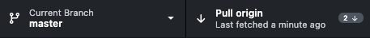

# Using Git

In this course, all exercises will be on GitHub, a website which hosts Git repositories online. This tutorial shows you how to set-up Git & GitHub.
## Terminology

**Git** is a powerful version control system to keep track of changes to files over time. Git is commonly used for both open source and commercial software development, but can be used to manage all kinds of files.

**GitHub** is a is a website which hosts Git repositories online, making it easier for developers to share code.

A **repository**, or Git project, encompasses the entire collection of files and folders associated with a project,  along with each file’s revision history.

## Introduction to Git

To help you get started with Git, here are some useful resources:

- Git Handbook (10 min. read): https://guides.github.com/introduction/git-handbook/
- Git Cheatsheet: https://training.github.com/downloads/github-git-cheat-sheet/

**Note:** While we recommend reading through the handbook before moving on to the rest of this tutorial, you will need only need to know the `clone` and `pull` commands to work on this course's exercises.

## Creating a GitHub account

First, you will need an account on [GitHub](https://github.com), the site on which the exercises are hosted. If you don't already have a GitHub account, [here](https://github.com/join) are instructions on how to create one.

**Note:** GitHub offers a [free tier](https://github.com/pricing) for everyone, which has everything you need for this course, although students can also have access to [free GitHub Pro](https://education.github.com/benefits/offers).

## Installing GitHub Desktop

While you can directly use Git from the command line, we recommend using an application such as GitHub Desktop to get started.

You can download GitHub Desktop at the following link: https://desktop.github.com/

**Note:** If you want to use Git from the command line instead, you will also need to install Git. GitHub provides [setup instructions](https://docs.github.com/en/github/getting-started-with-github/set-up-git) for this.

## Cloning the course's repository

All of this course's exercises can be found at: https://github.com/vita-epfl/introML-2023

In order to get a local copy of this repository, you will need to clone it.
In Git terminology, `cloning` means to creates a local copy of a project that already exists remotely.

To clone the repository, navigate to the main page and click on the **Code** button above the list of files. You can then click on the **Open with GitHub Desktop** button to clone and open the repository with GitHub Desktop. Once this is done, you will need to choose the local path in which the repository will be cloned with the **Choose...** button, and then click on the **Clone** button in the bottom right.

A step-by-step tutorial with pictures can be found [here](https://docs.github.com/en/desktop/contributing-and-collaborating-using-github-desktop/cloning-a-repository-from-github-to-github-desktop).

## Course workflow

The exercises and the solutions will be pushed directly to the course's repository. In order to update your local copy, you will need to `pull` the changes.

To do so with GitHub Desktop, you will first need to **Fetch origin**, and then **Pull origin**. We recommend fetching and pulling anytime you want to work on the exercises, in order to ensure that your local copy is up-to-date.

**Fetch:**

**Pull:**

For the exercises, there is **no need** to `add`, `commit` and `push` your changes anywhere.
