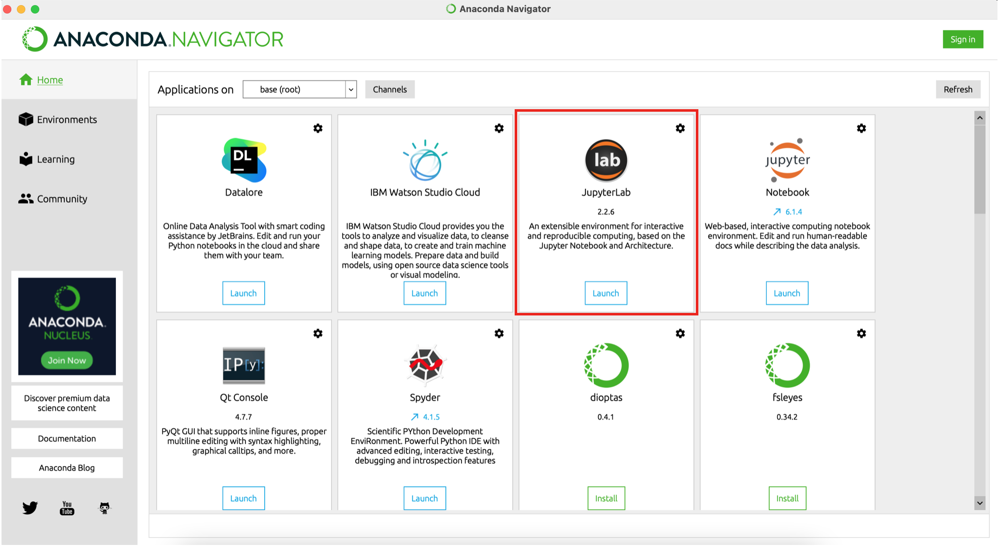
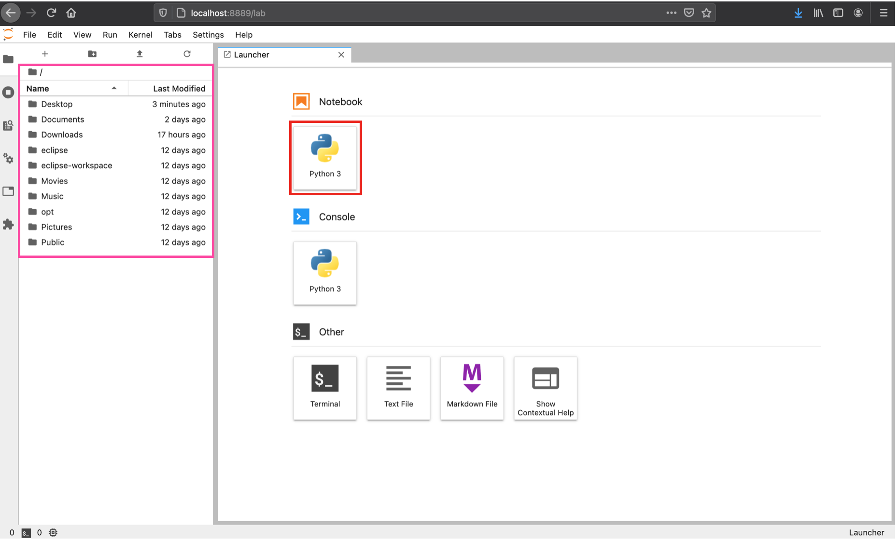
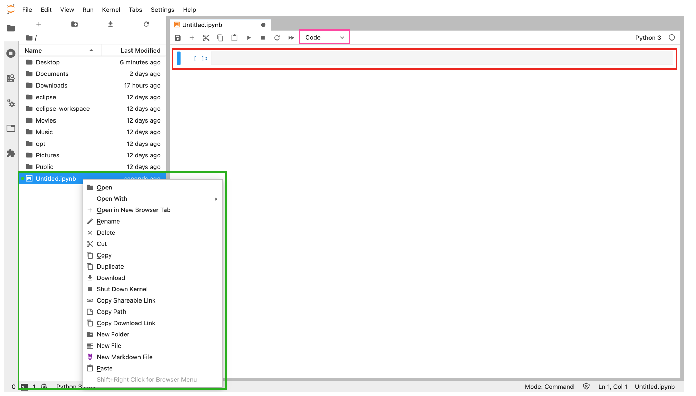
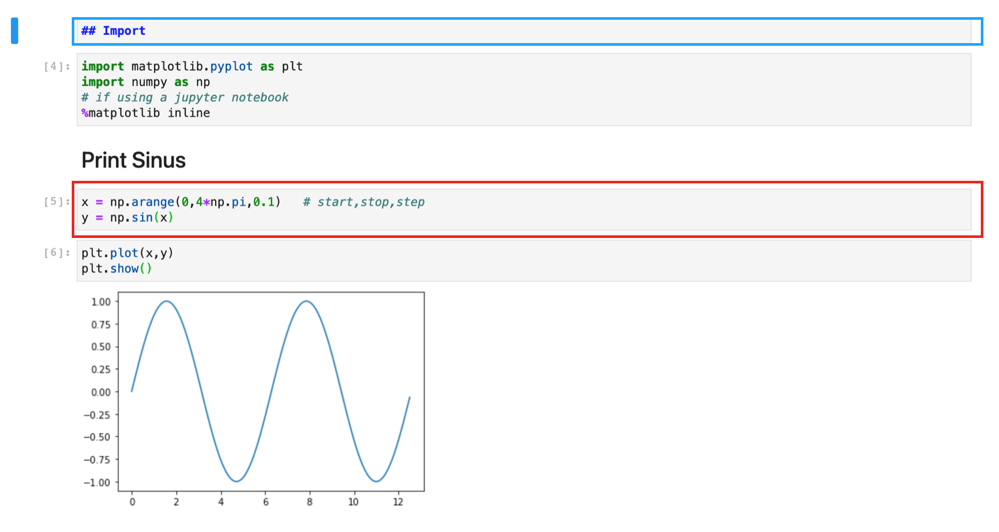
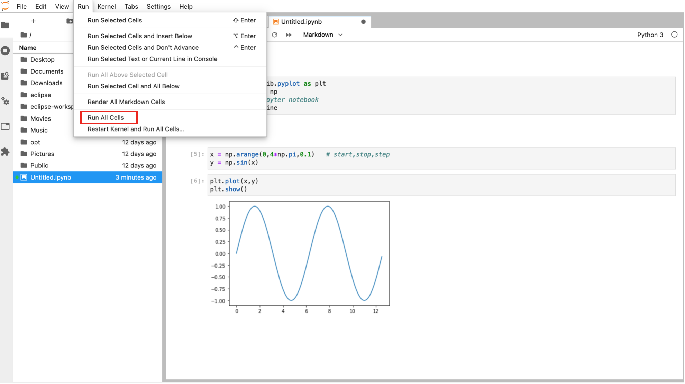
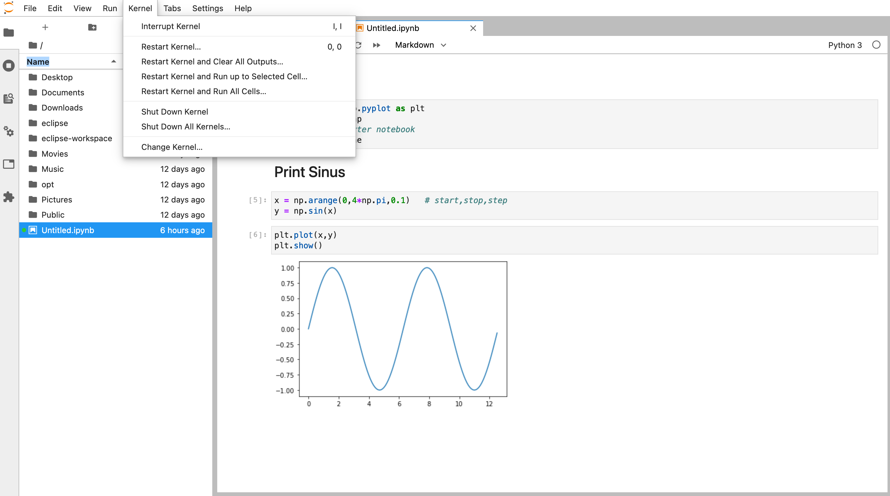

# Using Jupyter Notebooks and Jupyter Lab


## What is a Jupyter Notebook?

From the [Project Jupyter website](https://jupyter.org/):

> The Jupyter Notebook is an open-source web application that allows you to create and share documents that contain live code, equations, visualizations and narrative text. Uses include: data cleaning and transformation, numerical simulation, statistical modeling, data visualization, machine learning, and much more.

## What is Jupyter Lab?

Jupyter Lab is a web-based development environment for Jupyter Notebooks, code and data. You can also use it to view Markdown, PDF and text files.

## Launching Jupyter Lab

### From the terminal

Open the terminal, move to the desired directory (using `ls` and `cd`) and type:

```
jupyter lab
```

This will open a screen in your default Internet browser with a server containing your notebooks. Its address will be http://localhost:8888 and is only available on your computer. Note that once you start a server, you must keep the terminal window open.

### From Anaconda Navigator

By opening the Anaconda Navigator app, you will be given the option to launch several applications. Here, we are interested in  Jupyter Lab, which is shown boxed in red below:



By clicking on 'Launch', you will instantiate a Jupyter Lab server which should open in a new window in your default internet browser. This window will display the file directory of your home directory. From here you can navigate to your working folder.

## Interacting with Jupyter Lab and launching a Notebook

If everything launched correctly, you should be able to see a screen which looks something like this:



You will notice there will be a directory structure on the left-hand side of your window. On the right-hand side, we have a "launcher" interface where we can create a Jupyter Notebook (boxed in red), or several other types of files. To start a new notebook, click on the "Python 3" logo beneath "Notebook". You can also open an existing notebook from the directory.

Once you open a notebook, you will be brought to the following screen.




Some of the most important components of the notebook are highlighted in colored boxes.
- To rename your notebook (shown here as Untitled), you can right-click your document and select Rename.
- In purple is the cell formatting assignment. By default, it is set to "Code", but it can also be set to "Markdown".
- In red is a code cell, in which you can write Python code.
- In blue is a markdown cell, which is used to display nicely formatted text, images and mathematical equations.



#### Markdown cells
Here are some useful resources for Markdown cells:
- https://github.com/adam-p/markdown-here/wiki/Markdown-Cheatsheet
- https://www.datacamp.com/community/tutorials/markdown-in-jupyter-notebook

#### Code cells

Code cells support Python code (and other languages with different kernels, although we will only use Python in this course). They can be executed in any order.

- To run a single cell, use **Shift + Enter** or press on the ▶ button.
- To run all the cells starting from the beginning, go to `Run` -> `Run All Cells...`.




:warning: Code cells can be executed in any order. This means that you can overwrite your current variables by running cells out of order. This also means that variables declared in cells that were executed then deleted will still be present (known as a hidden state) unless the kernel is restarted. Therefore, **when coding in notebooks, be cautious of the order in which you run cells.** One solution to avoid hidden states is to frequently restart your kernel (and run up to your currently selected cell). This is covered more in depth in [this section](#the-kernel).

#### Autocompletion and documentation
Autocompletion is possible with JupyterLab too! Use **Tab**.


To view the documentation for a function or class, use **Shift + Tab**.

#### Keyboard shortcuts

You can gain a lot of time using [keyboard shortcuts](https://cheatography.com/weidadeyue/cheat-sheets/jupyter-notebook/pdf/) to navigate through notebooks.

## The kernel

The kernel maintains the state of a notebook's computations (such as current variables, declared functions and loaded data). For notebooks that do not take too long to run, it is desirable to frequently restart the kernel to ensure that there are no hidden states.

Here is a list of what the different kernel related actions do:



- **Interrupt ( or ■ button):** Causes the kernel to stop performing the current task without actually shutting the kernel down. You can use this option when you want to stop a very long task (eg. stop processing a large dataset).

- **Restart (or ↻ button):** Stops the kernel and starts it again. This action causes you to lose all the state data. In some cases, this is precisely what you need to do when the environment has become "dirty" with hidden state data.

- **Restart & Clear Output:** Stops the kernel, starts it again, and clears all the existing cell outputs.

- **Restart Kernel & Run Up to Selected Cell:** Stops the kernel, starts it again, and then runs every cell starting from the top cell and ending with the currently selected cell. Use this when you are working on a Notebook and want to make sure there are no hidden states.

- **Restart Kernel & Run All Cells:** Stops the kernel, starts it again, and then runs every cell starting from the top cell and ending with the last cell. Use this when you're done working on a Notebook and want to make sure everything runs properly and doesn't depend on hidden states.

- **Shutdown:** Shuts the kernel down. You may perform this step in preparation for using a different kernel.

- **Change Kernel:** Selects a different kernel from the list of kernels you have installed. For example, you may want to test an application using various Python versions to ensure that it runs on all of them.

## Additional resources

**Jupyter Notebook tutorial: https://www.dataquest.io/blog/jupyter-notebook-tutorial/**

**Jupyter Notebook documentation: https://jupyterlab.readthedocs.io/en/stable/user/notebook.html**

**Jupyter Lab interface documentation: https://jupyterlab.readthedocs.io/en/stable/user/interface.html**
