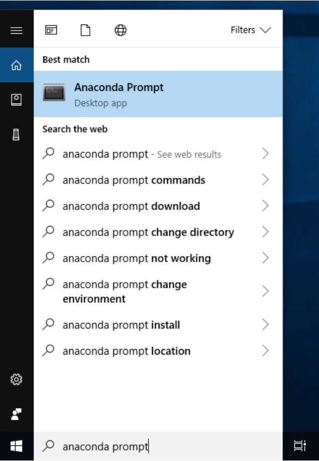

# Setting up a local Python environment


This tutorial will walk you through the steps needed to setup a local Python environment for this course, and how to launch Jupyter Lab once this environment is set up.

## Installing Anaconda

The first step is to install Anaconda Individual Edition (Python 3.8 version) by following the instructions on [this page](https://www.anaconda.com/products/individual).

Anaconda is a Python distribution for scientific computing, which uses conda as a package and environment management system. If needed, Anaconda provides a graphical user interface to conda, called [Anaconda Navigator](https://docs.anaconda.com/anaconda/navigator/getting-started/). However, in this tutorial, we will only use the terminal.


#### What is a virtual environment?


A virtual environment encapsulates all the tools (packages, plugins, ...) needed for a specific project. Each of these environments are isolated, which keeps the dependencies required for different projects separate. For example, this allows you to use different versions of the same package for different projects. For this reason, it is recommended to create a new virtual environment for each course or project.

## Using the terminal

The terminal (or command line) is a way to interact with your computer through text commands, giving you greater control of your system and increasing productivity. In Computer Science / Data Science / Machine Learning, many commands are only possible through the terminal, so being slightly familiar with it can be of great use.

####  On Mac / Linux

Use the default `Terminal` app.

Two key commands for navigating through the terminal are:
- `ls` (list): lists the files in the current directory.
- `cd` (change directory): changes the current directory. To go back one directory, use `cd ..`


#### On Windows

Use `Anaconda Prompt` (which got installed alongside Anaconda).



Two key commands for navigating through the terminal are:
- `dir` : lists the files in the current directory.
- `cd` (change directory): changes the current directory. To go back one directory, use `cd ..`


:information_source: If you want to know more about the terminal, [here is a useful guide](https://www.educative.io/blog/bash-shell-command-cheat-sheet) to the most common commands. For this course, `cd`, `ls` (or `dir` on Windows) and the few conda and Jupyter related commands listed below are those you'll most frequently use. You can find the Windows equivalent to the UNIX (Mac / Linux) commands [here](https://ftp.kh.edu.tw/Linux/Redhat/en_6.2/doc/gsg/ch-doslinux.htm).

## Creating the environment and installing packages

Now that Anaconda is installed and your terminal is open, follow these commands to setup an environment for this course:

#### Adding conda-forge as a channel
```
conda config --add channels conda-forge
```

#### Creating an environment

```
conda create --name introml python=3.8
```

#### Activating it
```
conda activate introml
```

**Note:** When opening a new terminal window, you'll be back in the default conda environment (`base`), so make sure to always use the command above to go back to the correct environment.

#### Installing necessary packages (can take a while)

```
conda install jupyter jupyterlab numpy scipy pandas matplotlib seaborn plotly scikit-learn ipywidgets tqdm "nodejs>=12.0"
```

:warning: If you are using the **32-bit version of Windows**, you'll encounter a problem with the Node.js installation. Please refer to [this updated setup guide](https://gist.github.com/dmizr/3fe4a30bfe0dddedfd2a94932ff9c00a) instead. 

Here is a brief description of what these packages are used for:
- Jupyter, JupyterLab: Web-based interface for Jupyter Notebooks
- Numpy, Scipy: Numerical and scientific computing
- Pandas: Data analysis and manipulation
- Matplotlib, Seaborn, Plotly, ipywidgets: Plotting / data visualization
- scikit-learn: Machine learning
- tqdm: Progress bar
- nodejs: JavaScript environment (needed for the JupyterLab extensions)

#### Installing JupyterLab extensions (can also take a while)
```
jupyter labextension install jupyterlab-plotly --minimize=False
jupyter labextension install @jupyterlab/toc --minimize=False
```

- The Plotly extension allows for interactive plots in notebooks.
- The toc extension adds a Table of Contents to notebooks. More info: https://github.com/jupyterlab/jupyterlab-toc

#### Launching Jupyter Lab

Go into the folder in which your project is and run:
```
jupyter lab
```

More info about Jupyter Lab is given in the next tutorial.


#### Shutting down the server

Once you're done working on JupyterLab (and everything is saved), you can shut down your Jupyter server with **Ctrl+C** in the terminal.

## Extras

#### Deactivating an environment
```
conda deactivate
```

#### Listing your environments (the active one is marked by an asterisk)
```
conda env list
```

#### For extra information, refer to the [conda cheat sheet](https://docs.conda.io/projects/conda/en/latest/user-guide/cheatsheet.html).

## How to re-open JupyterLab

Now that your `introml` environment has been created, you'll need much less commands to open JupyterLab again. The main steps to follow are:
- Opening the terminal
- Activating the `introml` environment: `conda activate introml`
- Navigating to the correct folder using `ls` and `cd`
- Launching JupyterLab: `jupyter lab`
